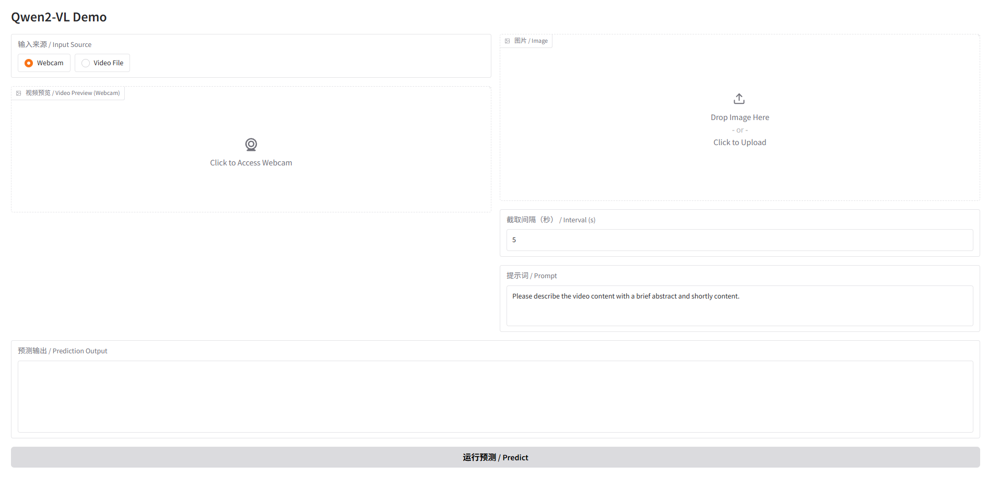

# Qwen-VL — Vision Language Model Demo on Snapdragon NPU

## Overview

**Qwen-VL** is a Vision Language Model (VLM) demonstration that supports understanding images, videos, and camera feeds, running on the Snapdragon NPU (HTP) via QAI AppBuilder. It supports both **Qwen2-VL** and **Qwen3-VL** models with a Gradio web UI.

- **Task**: Visual Question Answering / Image Understanding / Video Understanding
- **Models**: Qwen2-VL 2B, Qwen3-VL
- **Input**: Image / Video / Camera feed + text question
- **Output**: Text answer
- **Platform**: ARM64 Linux (Snapdragon), Windows on Snapdragon (WoS)
- **Runtime**: HTP (Hexagon NPU)
- **Interface**: Gradio web UI



## Model Architecture

Qwen-VL uses a multimodal transformer architecture:

| Component | Description |
| --------- | ----------- |
| Vision Encoder | Processes image/video frames into visual tokens |
| Language Model | Transformer decoder for text generation |
| Visual-Language Fusion | Cross-attention between visual and text tokens |

The model is split into multiple QNN context binaries for efficient NPU execution.

## Requirements

```bash
pip install requests==2.32.3 \
         py3-wget==1.0.12 \
         tqdm==4.67.1 \
         importlib-metadata==8.5.0 \
         qai-hub==0.30.0 \
         opencv-python==4.10.0.82 \
         gradio

pip install transformers==4.57.0 torch==2.9.1
pip install torchvision>=0.9.0
pip install qwen-vl-utils
```

## Quick Start

### Step 1: Prepare the Model

**Option A: Download pre-quantized model (recommended)**
```bash
wget https://www.aidevhome.com/data/adh2/models/suggested/qwen2vl2b.zip
unzip qwen2vl2b.zip
```

**Option B: Quantize and convert manually**

Follow the tutorial at:
https://qpm.qualcomm.com/#/main/tools/details/Tutorial_for_Qwen2_VL_2b_IoT

### Step 2: Set Environment Variables

```bash
export QNN_SDK_ROOT=/path/to/qnn/sdk
export LD_LIBRARY_PATH=$QNN_SDK_ROOT/lib/aarch64-oe-linux-gcc11.2
export ADSP_LIBRARY_PATH=$QNN_SDK_ROOT/lib/hexagon-v73/unsigned
export LD_PRELOAD=/usr/lib/aarch64-linux-gnu/libtbb.so.12
```

> Replace `/path/to/qnn/sdk` with your actual QNN SDK installation path.

### Step 3: Launch the Demo

**Qwen2-VL (default)**:
```bash
python qwen_vl.py --model qwen2 --path /path/to/qwen2_vl_model
```

**Qwen3-VL**:
```bash
python qwen_vl.py --model qwen3 --path /path/to/qwen3_vl_model
```

## Arguments

| Argument | Default | Description |
| -------- | ------- | ----------- |
| `--model` | `qwen2` | Model type: `qwen2` or `qwen3` |
| `--path` | Required | Path to the directory containing QNN model files |

## Input/Output

| | Format | Description |
| - | ------ | ----------- |
| **Input** | Image / Video / Camera | Visual input for the model |
| **Input** | Text question | Natural language question about the visual input |
| **Output** | Text answer | Model's response to the question |

## Demo Features

The Gradio web UI supports:
- **Image understanding**: Upload an image and ask questions about it
- **Video understanding**: Upload a video and ask questions about its content
- **Camera feed**: Use live camera input for real-time visual Q&A

## Files

| File | Description |
| ---- | ----------- |
| `qwen_vl.py` | Main demo script with Gradio UI |
| `qwen2_vlm_qnn.py` | Qwen2-VL QNN inference implementation |
| `qwen3_vlm_qnn.py` | Qwen3-VL QNN inference implementation |
| `vlm_inference.py` | Shared VLM inference utilities |
| `vlm_demo.png` | Demo screenshot |

## Example Use Cases

- **Image Q&A**: "What objects are in this image?" / "Describe the scene."
- **Document understanding**: "What does this sign say?" / "Summarize this document."
- **Video analysis**: "What is happening in this video?" / "Describe the action."
- **Visual reasoning**: "How many people are in the image?" / "What color is the car?"

## Notes

- This demo is primarily designed for **ARM64 Linux** (Snapdragon IoT/embedded platforms).
- The model requires QNN SDK libraries to be properly configured via environment variables.
- Qwen2-VL 2B is the recommended starting model for its balance of quality and speed.
- For Windows on Snapdragon, ensure the QNN SDK libraries are in the system PATH.
